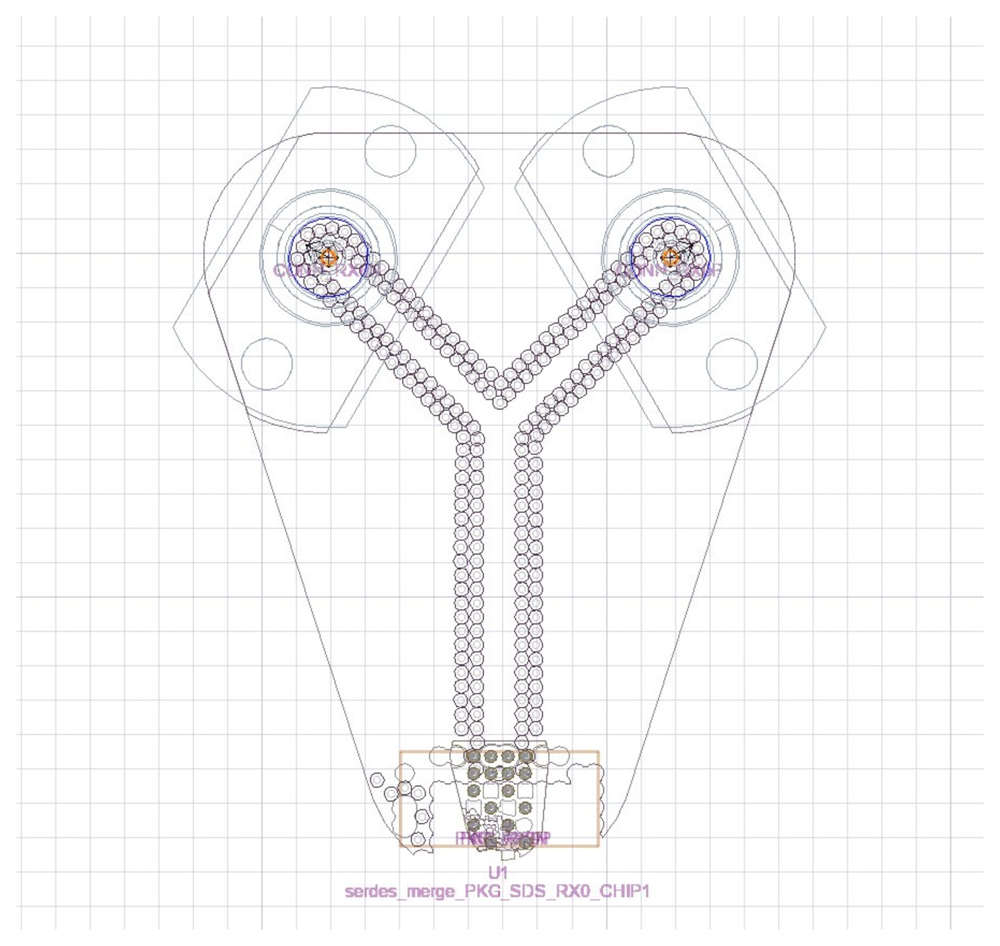
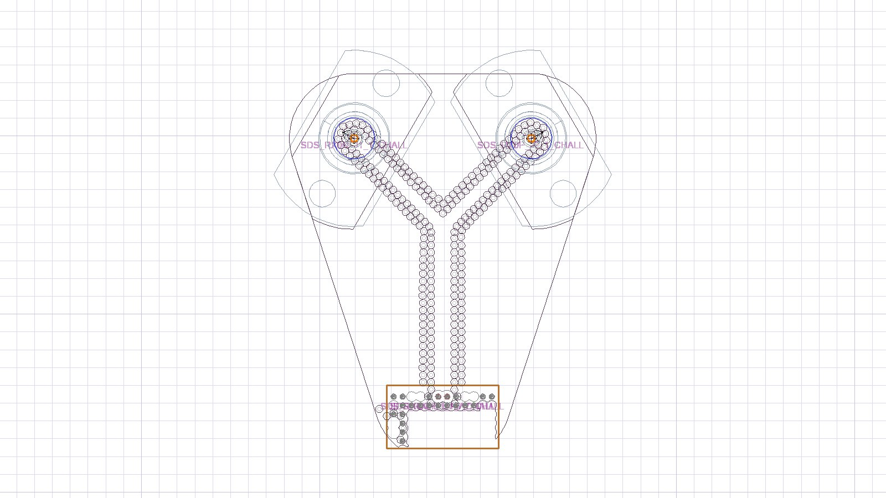
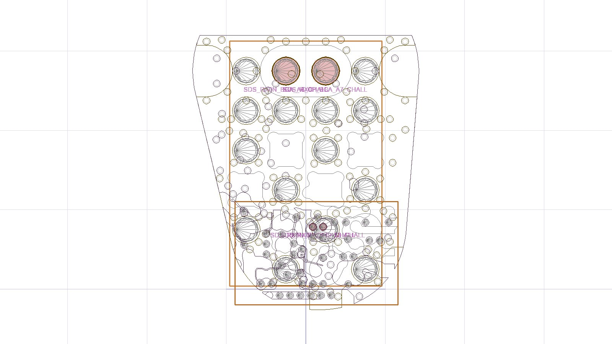

# Ketupa H3DL SerDes Demo

**PCB · Package · PCB–Package co-modeling**

**Linux x86_64 | CPython 3.12 | Native core | v1.0.1**

[简体中文（当前）](README.md) | [English](README_EN.md) | [许可证](LICENSE)

面向 112G/224G SerDes 通道的 HFSS 3D Layout 自动建模 Demo：以同一组设计输入运行 PCB、PKG 或 Merge 工作流。名称中的速率是 Demo 应用场景，不代表已完成相应速率的电气合规验证。

**作者：** hongbo.li

**联系方式：** asenjoaupa@gmail.com · 3405802009@qq.com

**许可：** Proprietary Evaluation License（公开分发、闭源原生核心，不是开源许可证）



*真实工程视图：AEDT 2026 R1，`serdes_merge_SDS_RX0_CHIP1`，RX0。该图于 2026-10-06 从已保存工程直接导出，是布局视图，不是场分布图或求解结果。*

## 中文使用指南

### 1. 项目定位与交付内容

本仓库交付可运行的 Linux 原生 Demo，保留主入口和预处理脚本的可编辑性。`lib/`、`modules/` 和 `resource/` 使用 119 个 CPython 3.12 原生 `.so` 扩展，内部模板/配置随核心提供；不附核心 Python 源码、编译中间文件、许可证、历史仿真结果或独立 docs。

```text
Ketupa_h3dl_serdes_demo/
├── README.md                     中文完整使用说明（GitHub 主页面）
├── README_EN.md                  English guide
├── LICENSE                       专有 Demo 评估许可
├── SHA256SUMS                    发布文件校验清单
├── assets/                       实际 HFSS 模型视图
└── linux/                        进入此目录运行
    ├── main.py                   场景、输入、模式、并发配置
    ├── input/
    │   ├── PCB/                  BRD、叠层、网络和放置 Excel
    │   ├── PKG/                  SIP/AEDB、叠层、网络 Excel
    │   └── Connector/            连接器 A3DCOMP
    ├── script/                   开放的提取、分类、预处理代码
    │   └── extractors/cds_env    首次部署的三个工具路径
    ├── modules/                  原生入口与三个 workflow
    ├── lib/                      原生建模核心
    └── resource/                 原生资源与模型策略
```

Demo 的 PCB/PKG 版图、配套 Excel、叠层和连接器文件全部保留。第三方 EDA 安装及有效授权需自行准备。本包不包含其他九种工作流，也不提供 Windows `.pyd`。

### 2. 环境要求

| 项目 | 要求与边界 |
|---|---|
| 平台 | Linux x86_64、兼容 glibc；非 Windows、ARM、PyPy 或 Alpine/musl 包 |
| Python ABI | **CPython 3.12**，建议使用现有 Ketupa 运行环境，不要直接更换系统 Python |
| 启动器 | 已安装且可用的 `ketupa` 命令及合法授权；本仓库不包含安装器 |
| EDA | Ansys Electronics Desktop / HFSS 3D Layout；Cadence SPB Extracta/Report 用于 BRD/SIP 导入或预处理 |
| Python 依赖 | Ketupa 环境中的 `openpyxl`、`numpy`、`cryptography`、`pyedb`、`psutil` 等；由 `doctor` 检查 |
| 资源 | 依据当前可用 CPU/内存限制并发；本地证据来自约 30 GB 内存主机，不是所有模型的最低内存保证 |
| 版本证据 | AEDT **2026 R1** 已执行建模与原生设计检查；存在 2025/2026 兼容路径，但本包没有 2025 实机回归证据 |

先确认 `ketupa --help` 可用。未安装启动器时请联系作者取得适配的运行环境；不要把无关的同名软件当作本项目依赖。

### 3. 下载与首次配置

```bash
git clone https://github.com/Shallot-2009/Ketupa_h3dl_serdes_demo.git
cd Ketupa_h3dl_serdes_demo
sha256sum -c SHA256SUMS
cd linux
```

也可使用 GitHub **Code → Download ZIP**，完整解压后进入 `linux/`。不要只下载 `main.py`，不要漏掉 Excel、`.aedb` 内容或隐藏在子目录中的原生扩展。

首次部署只需按实际安装位置编辑 `script/extractors/cds_env` 的三个路径：

```ini
PYTHON_EXE=/your/ketupa/runtime/bin/python
CADENCE_TOOLS_BIN=/your/cadence/tools/bin:/your/older/cadence/tools/bin
KETUPA_ANSYSEDT=/your/ansys/AnsysEM
```

包内 `/home/EDA/...` 是开发机示例，不是通用安装路径。多个 Cadence 目录按优先级排列，用 `:` 分隔。这里不填写许可证或 API 密钥；厂商许可证按各自正常安装流程配置。完成首次工具路径配置后，日常选场景和换输入只改 `main.py`。

### 4. 推荐运行顺序

以下所有命令均在 `linux/` 下执行。`--` 将后续参数传给项目入口。

```bash
ketupa run -sh main.py -- list
ketupa run -sh main.py -- doctor
ketupa run -sh main.py -- audit
ketupa run -sh main.py -- --dry-run
ketupa run -sh main.py
```

| 命令 | 做什么 | 不代表什么 |
|---|---|---|
| `list` | 列出 PCB、PKG、Merge | 不建模 |
| `doctor` | 检查依赖、工具、授权可达性及资源环境 | 不保证任意工程成功 |
| `audit` | 检查架构、配置、端口约定及原生核心完整性 | 不替代 AEDT 原生检查 |
| `--dry-run` | 校验输入，列出网络组、任务与并行计划 | 不启动建模/求解 worker，无仿真结果 |
| 无额外参数 | 执行 `main.py` 保存配置 | 默认 **Merge、Mode 0**，仅建模保存 |

终端最上方 `Layout input: not provided` / `script default` 是外层 Ketupa CLI 的参数摘要；不等于 `main.py` 中没有输入。请看后续实际选中的工作流、文件和网络组。`[managed resource]` 是路径遮蔽文本，不是应创建的文件名。

### 5. 只改 main.py 选择任意组合

修改 `SELECTIONS`，三种工作流共有七种非空组合：

| 组合 / Combination | `SELECTIONS` |
|---|---|
| PCB | `(("serdes", "pcb"),)` |
| PKG | `(("serdes", "pkg"),)` |
| Merge | `(("serdes", "merge"),)` |
| PCB + PKG | `(("serdes", "pcb"), ("serdes", "pkg"))` |
| PCB + Merge | `(("serdes", "pcb"), ("serdes", "merge"))` |
| PKG + Merge | `(("serdes", "pkg"), ("serdes", "merge"))` |
| 全部 / All | `(("serdes", "all"),)` |

Merge 自行导入 PCB 和 PKG，**不要求先跑独立 PCB/PKG**。组合中的工作流依次执行，每个工作流内部按网络组并行。

`INPUTS["default"]` 定义共用输入；只有特定场景不同才添加覆盖，例如：

```python
INPUTS["serdes-pkg"] = {
    "pkg_netlist": PKG_DIR / "netlist/another_design.xlsx",
}
```

网络/放置字段可指向精确 Excel/CSV 或含匹配表格的目录；版图和叠层应指向真实文件，`.aedb` 应指向含 `edb.def` 的目录。版图、叠层、网络和放置数据必须对应同一设计。随包默认使用 PCB BRD 与 PKG AEDB，另保留 PKG SIP 输入。

`RUN_OPTIONS` 的主要设置：

| 设置 | 用途 |
|---|---|
| `mode: 0` / `mode: 1` | 0 建模保存；1 建模、求解及对应导出 |
| `dry_run: True` | 只校验和规划 |
| `prefix: "ALL"` | 选择所有匹配网络 |
| `corps: "\\"` | 不增加额外合组 |
| `parallel_groups: ""` | 全部匹配组；单组示例为 `"ALL\|SDS_RX0"`（实际字符串不含转义符） |
| `max_workers: None` | 使用自动策略；改为 `1` 可限制资源占用，仍有内存保护 |
| `preprocess: False` | 直接用 Demo 已附 Excel；替换输入、需要重提取时设为 `True` |
| `preprocess_entry: "sh"` | Linux 预处理入口 |
| `signoff: False` | 默认不自动生成签核汇总；TBD 指标不得宣称电气 PASS |

不改 main 的临时命令（显式命令行参数覆盖保存配置）：

```bash
ketupa run -sh main.py -- run serdes pcb --mode 0
ketupa run -sh main.py -- run serdes pkg --mode 0
ketupa run -sh main.py -- run serdes merge --mode 0
ketupa run -sh main.py -- run-many serdes-pcb serdes-pkg --dry-run
ketupa run -sh main.py -- run-all --dry-run
ketupa run -sh main.py -- --max-workers 1 --parallel-groups 'ALL|SDS_RX0'
ketupa run -sh main.py -- run --help
```

### 6. 数据预处理与端口边界

Demo 已附三份 Excel 及其来源记录。首次运行不需要重提取；更换版图后必须更新输入并检查分类结果，不能沿用另一份设计的表。

```bash
bash script/00_Preprocess.sh
# 按交互提示选择 serdes、all、Y 等
# 或在执行保存的工作流之前自动预处理：
ketupa run -sh main.py -- --preprocess-first
```

`script/01_Netlist.*` 负责网络提取分类，`02_Placement.*` 负责 PCB 放置，`extractors/` 保留 Cadence 兼容和命名规则。可扩展企业命名规则；不保证任意未知命名都能无歧义自动识别。可选 LLM 入口不是默认运行依赖，也不应在没有授权时发送设计数据到外部服务。

| 模式 | 最终端口边界 | 裁剪距离 |
|---|---|---|
| PCB | BGA solder ball → PCB connector | PCB `3.5mm` |
| PKG | DIE C4 bump → BGA solder ball | PKG `1mm` |
| Merge | DIE C4 bump → PCB connector，无中间 BGA 端口 | PCB `3.5mm` / PKG `1mm` |

C4 为 Flip-Chip / chip-down，沿用库参数：**高度 60 µm、半径 65 µm**（`sbr`，不要将历史文件名 `d65um` 当作直径证据）。BGA 使用 **0.5 mm pitch** 库，pitch 不等于球径。Merge 保留 C4 参考面、取消中间 BGA 端口与受控 BGA PEC 辅助面；使用 Placement 的上下表面和旋转信息对齐。PKG 的 AUTO 参考网策略保留实际存在的 VSS/AGND，不擅自短接独立地网。

<details>
<summary>PCB / PKG 的实际 HFSS 视图 · More actual HFSS model views</summary>



PCB: `serdes_pcb_SDS_RX0_CHIP1` — solder-to-connector layout view.



PKG: `serdes_pkg_SDS_RX0_DIE_1` — bump-to-solder layout view. Both images were exported from saved AEDT 2026 R1 projects, not synthesized illustrations.

</details>

### 7. 输出位置、验收与排错

运行时在 `linux/output/` 创建任务记录和结果，发布仓库不包含旧 output：

```text
output/
├── tasks/<run_id>/                          输入、状态、事件记录
└── serdes_{pcb,pkg,merge}/<run_id>/
    ├── h3d_projects/                       .aedt + 配套 .aedb
    │   └── parallel_workers/               各网络组的独立工程
    ├── logs/                               工作流/网络组/资源日志
    └── results/                            求解/导出阶段的结果（按阶段生成）
```

在 AEDT 中打开**当前 run_id 的 `.aedt`**，保留其关联 `.aedb` 及嵌入组件。网络组的实际工程可按 `h3d_projects/models.json` 定位；不要把 `input` 原版图、cutout 中间工程或旧任务当作最终通道。Mode 0 不含新求解结果；Mode 1 需要可用的 solver 授权和足够资源。手动求解后可显式导出：

```bash
ketupa run -sh main.py -- export serdes merge --project /absolute/path/channel.aedt
```

**验证范围（2026-10-06）：**

- 原生核心 119 个 `.so`；无核心 `.py/.pyc`；核心篡改拒绝检查通过。
- PCB/PKG/Merge 七种组合 dry-run 通过，迁移到本仓库 `linux/` 后审计和输入检查通过。
- AEDT 2026 R1 三场景各 RX0 的 Mode 0 建模成功；保存工程的四端口名称、顺序、阻抗和参考网与对应源码结果一致；重新打开后 `ValidateCircuit()` 均返回 `1`。
- 原生包默认 Merge 的 RX/TX 两组通过实际 `ketupa run -sh main.py` 建模，2 成功、0 失败。早先启动器目录权限问题已不再阻止该次运行。
- **未验证：**完整 Mode 1 求解、网格收敛与电气 signoff、AEDT 2025 实机、Windows/ARM/其他 Linux 发行版组合。
- **已知提醒：**PCB/Merge 连接器 J3D1/J3D2 有 “does not contain any priority bodies” 材料覆盖提醒。原生检查通过不等于材料重叠与电气精度已验收；本版本没有自动改变该模型物理设置。

| 现象 | 处理 |
|---|---|
| `pcb_netlist ... not found: [managed resource]` | 检查 main 指向的三份 Excel 是否完整；重新下载缺失文件，或对匹配版图重新预处理。默认 `preprocess=False` 不会自动补表。 |
| 找不到 `.so` / import 失败 | 使用完整目录和 CPython 3.12 x86_64 环境；不要把本包拿到 Windows/其他 Python ABI 使用。 |
| Extracta 路径/版本无法识别 | 核对 `cds_env` 的 Cadence 路径及厂商工具授权，先执行 `doctor`。 |
| `/var/lib/openketupa-license/...` 权限拒绝 | 这是启动器的本机授权目录权限问题，由管理员恢复正确的用户组/读取/遍历权限；不要 `chmod 777` 或绕过授权。 |
| 内存紧张 | `--max-workers 1`，并先用 `--dry-run` 查看工作负载。 |
| `CONFIG NOTE ... TBD` | 电气判据尚未批准，不是可忽略后宣称合规的 PASS，也不必然阻止 Mode 0 建模。 |

### 8. 许可与保护边界

本仓库是**公开可下载的专有 Demo，不是开源核心**。采用 [Proprietary Evaluation License](LICENSE)：允许学习、研究、企业内部非生产评估及修改开放脚本/配置；商业生产、付费交付或修改版分发需联系作者。GitHub 可能将自定义许可显示为 “Other” 而非标准开源许可证。

原生编译、符号裁剪与完整性校验提高逆向成本，**不等同于密码学加密，不能保证绝对保密或不可逆向**。用户可见自己的输入、参数、日志及生成工程；公开仓库不能隐藏其提交历史中的文件。不要提交许可证、API 密钥、私有设计或核心构建源码。Ansys/Cadence 等商标归各自权利人所有，本项目不表示官方认证或合作。
