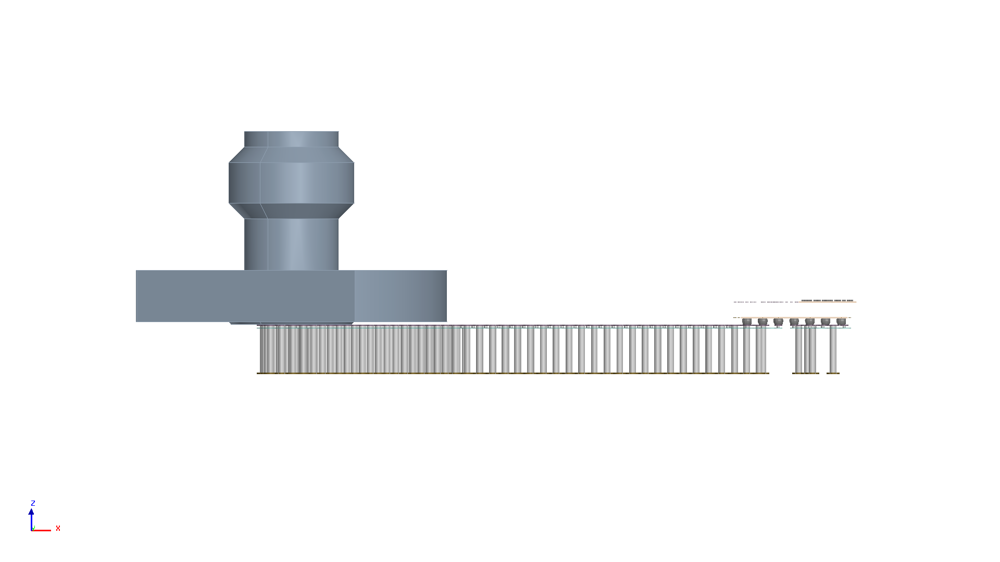

# Ketupa H3DL SerDes Demo

[简体中文](README.md) | [English](README_EN.md) | [License](LICENSE)

HFSS 3D Layout modeling for 112G/224G SerDes channels: PCB, package and PCB–package Merge. Version v1.0.1, Linux / Windows x64, CPython 3.12.

Author: Asenjo.HB.L · China, Shanghai

Contact: asenjoaupa@gmail.com · 3405802009@qq.com

## Choose your platform

| Platform | Entry | Native core | Qualification |
|---|---|---|---|
| Linux x86_64 | [serdes_linux](serdes_linux/README.md) | `.so` | Existing Linux acceptance evidence retained below |
| Windows x64 | [serdes_windows](serdes_windows/README.md) | `.pyd` | Offline source/native parity passed; licensed startup and real three-case modeling acceptance pending |

Both platforms provide PCB, PKG and Merge workflows, an editable `main.py`, and preprocessing scripts. Use the native modules for the selected platform.

### Windows quick start

Install the Windows Runtime below, import the Release asset `Ketupa-Demo-30-Day-Trial.lic` in License Manager and enable its service. Trial validity, binding and license terms still apply. The repository's `LICENSE` document is not an activation file.

In `serdes_windows`, configure `script/extractors/cds_env` following the [Windows instructions](serdes_windows/README.md), then run:

```bat
ketupa run -sh main.py -- doctor
ketupa run -sh main.py -- preprocess serdes all -- --force
ketupa run -sh main.py -- audit
ketupa run -sh main.py -- --dry-run
ketupa run -sh main.py
```

Alternatively double-click `script/00_Preprocess.exe`; logs go to `output/logs/preprocessing`. Default: Merge / Mode 0. Individual cases use `run serdes pcb`, `run serdes pkg`, or `run serdes merge`. No core source, customer input, private keys, activated licenses or output artifacts are published in the Windows folder. Linux instructions follow below.

## Requirements and downloads

Requires licensed Ketupa, Ansys Electronics Desktop and Cadence SPB. Linux uses `ketupa-launch-v1`; Windows validates the matched official Runtime, live Ketupa process ancestry and licensing service. Both require platform-native CPython 3.12; ordinary Python is not a substitute for an authorized launch.

[Runtime installers](https://github.com/Shallot-2009/Ketupa_h3dl_serdes_demo/releases/tag/runtime-v1.0.0):

| Platform | File |
|---|---|
| Linux x86_64 | `Ketupa-Runtime-1.0.0-Linux-x64.tar.gz` |
| Debian / Ubuntu | `ketupa-runtime-installer_1.0.0_amd64.deb` |
| Windows x64 | `Ketupa-Runtime-1.0.0-Windows-x64-Setup.exe` |

Choose one Linux format. Licensing is separate. Installer binaries are unchanged; matching Python versions do not guarantee authorization-interface compatibility. Keep using an existing compatible environment; this revision replaces project files only.

Download the current project:

~~~bash
git clone https://github.com/Shallot-2009/Ketupa_h3dl_serdes_demo.git
cd Ketupa_h3dl_serdes_demo
sha256sum -c SHA256SUMS
cd serdes_linux
~~~

Alternatively, use **Code → Download ZIP**. Release source archives are tagged snapshots and may differ from main.

## First run

Set the tool paths in `script/extractors/cds_env`:

~~~ini
PYTHON_EXE=/home/EDA/openketupa-runtime-linux/runtime/bin/python3
CADENCE_TOOLS_BIN=/your/cadence/tools/bin
KETUPA_ANSYSEDT=/your/ansys/AnsysEM
~~~

Separate multiple Cadence paths with `:`. Spreadsheets are not shipped. Generate the PCB netlist, PCB placement and PKG netlist before the first model build:

~~~bash
ketupa run -sh main.py -- doctor
ketupa run -sh main.py -- audit
ketupa run -sh main.py -- preprocess serdes all -- --force
ketupa run -sh main.py -- --dry-run
ketupa run -sh main.py
~~~

The default is Merge, Mode 0: build and save only. If inputs have not changed, subsequent runs need only the last command. Repeat preprocessing after replacing layouts.

| Command | Purpose |
|---|---|
| `list` | List workflows |
| `doctor` | Check environment and tools |
| `audit` | Check configuration and core integrity |
| `--dry-run` | Validate inputs and list tasks; no modeling or solving |

## Configure main.py

Select any combination in `SELECTIONS`:

~~~python
SELECTIONS = (
    ("serdes", "pcb"),
    ("serdes", "pkg"),
    ("serdes", "merge"),
)
~~~

Keep one entry to run a single workflow. Merge does not require standalone PCB or PKG runs first.

- `INPUTS`: layout, stackup, netlist, placement and connector paths. Table inputs accept files or directories.
- `RUN_OPTIONS["mode"]`: 0 builds; 1 builds and solves.
- `RUN_OPTIONS["max_workers"]`: `None` for automatic allocation; `1` for one worker.
- `RUN_OPTIONS["preprocess"]`: defaults to `False`, using locally generated workbooks.

Temporary overrides without editing main:

~~~bash
ketupa run -sh main.py -- run serdes pkg --mode 0
ketupa run -sh main.py -- run-many serdes-pcb serdes-merge --dry-run
ketupa run -sh main.py -- run-all --dry-run
ketupa run -sh main.py -- --max-workers 1
~~~

## Models and ports

| Workflow | Channel boundary | Cutout expansion |
|---|---|---|
| PCB | BGA solder ball → connector | 3.5 mm |
| PKG | C4 bump → BGA solder ball | 1 mm |
| Merge | C4 bump → PCB connector; no intermediate BGA ports | PCB 3.5 mm / PKG 1 mm |

Flip-Chip, chip-down. C4 height: 60 µm; radius: 65 µm. BGA pitch: 0.5 mm. Merge uses placement data for alignment, keeps the C4 reference treatment and removes the intermediate BGA helper PEC sheet. Separate VSS and AGND nets are not forcibly shorted.

### Model views

Layout and connector screenshots are from AEDT 2026 R1, not solved results.

Merge:


PCB:


Package:


1.0 mm / 110 GHz coaxial connector, not a standard SMA model:


Side view of the Merge model in AEDT 2026 R1, showing the connector, PCB and package. Exported directly from the current model viewport; no solve was performed.


## Output

~~~text
output/
├── tasks/<run_id>/                     Task and input records
└── serdes_{pcb,pkg,merge}/<run_id>/
    ├── h3d_projects/                  AEDT/AEDB projects
    ├── logs/                          Execution logs
    └── results/                       Solve and export results
~~~

Open the current run's final `.aedt` and retain its associated `.aedb`. Per-group projects are listed in `h3d_projects/models.json`. Mode 0 produces no new solved results.

## Validation and troubleshooting

2026-10-07, AEDT 2026 R1: clean-copy preprocessing, audit, doctor and all seven dry-run combinations passed. RX/TX Mode 0 builds across three workflows: six successes, zero failures. Direct Python launch was rejected. Mode 1 solving, electrical signoff and AEDT 2025 on an actual host were not validated.

| Issue | Action |
|---|---|
| Missing netlist / placement | Run preprocessing first |
| `KETUPA_AUTH_REQUIRED` | Check the matching Runtime and valid license; launch through ketupa |
| Native import failure | Check Linux x86_64, CPython 3.12 and file integrity |
| Extracta path/version error | Check `cds_env` and Cadence licensing |
| Insufficient memory | Set `max_workers=1` |

Connector material-priority advisories remain. Successful modeling does not establish electrical accuracy or compliance.

## License

This is a proprietary evaluation Demo; see [LICENSE](LICENSE). `main.py` and `script/` are editable. The core is distributed as native extensions; native compilation does not make reverse engineering impossible. Obtain Ansys and Cadence software and licenses separately.
